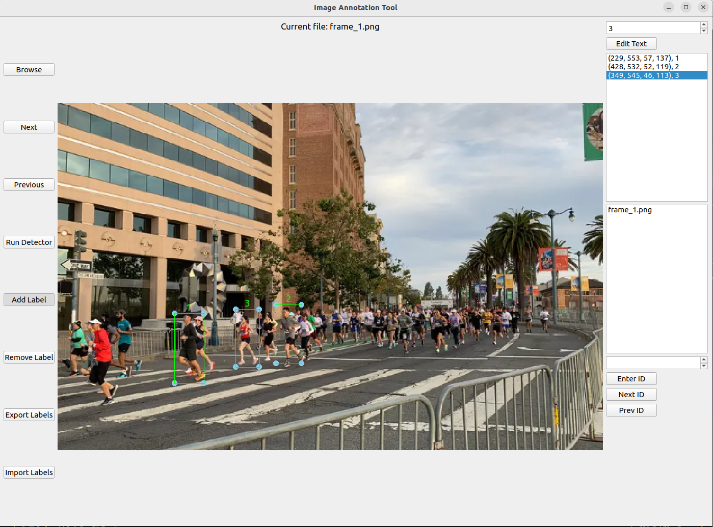

# Label Track

This is a Python application that serves as an image annotation tool, specifically multi object tracking annotation purpose. It allows users to browse through a directory of images, add labels to specific regions of interest (ROIs) within the images, and export the annotations to a text file.

 

## Requirements

- Python 3.x
- PyQt5
- OpenCV
- Ultralytics (YOLO v8)

## Usage

1. Run the `main.py` script to launch the application.
2. Click on the "Browse" button to select a directory containing the images you want to annotate.
3. Use the "Next" and "Previous" buttons to navigate through the images.
4. To add a label to an ROI, click on the "Add Label" button and then click and drag on the image to define the bounding box of the ROI. Enter the label text in the text widget and click "Enter ID" to save the label.
5. To edit the label text, select the label from the list widget and click the "Edit Text" button. Make the necessary changes in the text widget and click "Enter ID" to save the changes.
6. To remove a label, select it from the list widget and click the "Remove Label" button.
7. To export the annotations to a text file, click on the "Export Labels" button. You will be prompted to choose a file name and location for the exported file.
8. To import existing annotations from a text file, click on the "Import Labels" button. Select the desired text file containing the annotations.
9. To run the YOLO object detection algorithm on the annotated images, click on the "Run Detector" button. This requires the `yolo.py` script to be present in the same directory.
10. To resize bounding box, click and hold the circle on the corner of the bounding box and drag it to the desired size.
11. To move bounding box, click and hold any point inside the designated bounding box and drag it to the desired location.

## Additional Features

- The application supports keyboard shortcuts for navigating through the images. Press "d" to go to the next image and "a" to go to the previous image. Press "R" to remove selected label.
- The application allows users to enter an ID and load previously saved images associated with that ID. Use the "Next ID" and "Prev ID" buttons to navigate through the saved images.

## Saved IDs

The application creates a folder named "saved IDs" in the current directory to store images associated with specific IDs. Each ID has its own subfolder within the "saved IDs" folder. The images are saved in the format "frame{frame_num}_{image_dir[-2:]}.jpg".

## Notes
- Annotation file is automatically saved in MoT format. Make sure copy the automatically save file before you re-open the program when program crashes.
- The name of image files in your directory should meet the format as follows: frame_1.jpg, frame_2.jpg, frame_3.jpg, etc.
